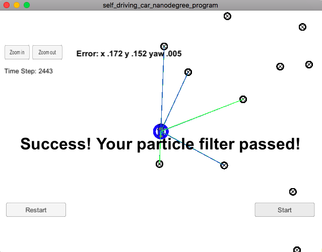

# Particle Filter for Localizing a Car!

## Project Introduction
Your robot has been kidnapped and transported to a new location! Luckily it has a map of this location, a (noisy) GPS estimate of its initial location, and lots of (noisy) sensor and control data.

I implement a 2 dimensional particle filter in C++. The particle filter is given a map and some initial localization information (analogous to what a GPS would provide). At each time step the filter also gets observation and control data, which are basically a set of observed landmarks at a particular distance from the car and its previous velocity and yaw angle respectively.

## Results
(Because you might not want to read the rest of this README)

I used only 10 particles in this case because the map is simple, so it runs quite fast (although I could probably get similar results with even fewer particles).

Ta-da!!!



## Running the Code
This project involves the Term 2 Simulator which can be downloaded [here](https://github.com/udacity/self-driving-car-sim/releases)

This repository includes two files that can be used to set up and intall uWebSocketIO for either Linux or Mac systems. For windows you can use either Docker, VMware, or even Windows 10 Bash on Ubuntu to install uWebSocketIO.

Once the install for uWebSocketIO is complete, the main program can be built and ran by doing the following from the project top directory.

mkdir build
cd build
cmake ..
make
./particle_filter

Note that the programs that need to be written to accomplish the project are src/particle_filter.cpp, and particle_filter.h

The program main.cpp has already been filled out, but feel free to modify it.

Here is the main protcol that main.cpp uses for uWebSocketIO in communicating with the simulator.

INPUT: values provided by the simulator to the c++ program

// sense noisy position data from the simulator

["sense_x"] 

["sense_y"] 

["sense_theta"] 

// get the previous velocity and yaw rate to predict the particle's transitioned state

["previous_velocity"]

["previous_yawrate"]

// receive noisy observation data from the simulator, in a respective list of x/y values

["sense_observations_x"] 

["sense_observations_y"] 


OUTPUT: values provided by the c++ program to the simulator

// best particle values used for calculating the error evaluation

["best_particle_x"]

["best_particle_y"]

["best_particle_theta"] 

//Optional message data used for debugging particle's sensing and associations

// for respective (x,y) sensed positions ID label 

["best_particle_associations"]

// for respective (x,y) sensed positions

["best_particle_sense_x"] <= list of sensed x positions

["best_particle_sense_y"] <= list of sensed y positions


# Implementing the Particle Filter
The directory structure of this repository is as follows:

```
root
|   build.sh
|   clean.sh
|   CMakeLists.txt
|   README.md
|   run.sh
|
|___data
|   |   
|   |   map_data.txt
|   
|   
|___src
    |   helper_functions.h
    |   main.cpp
    |   map.h
    |   particle_filter.cpp
    |   particle_filter.h
```

## Inputs to the Particle Filter
You can also find the inputs to the particle filter in the `data` directory. 

#### The Map*
`map_data.txt` includes the position of landmarks (in meters) on an arbitrary Cartesian coordinate system. Each row has three columns
1. x position
2. y position
3. landmark id

## How the code works
1. Initializes the system with a certain number of particles, using noisy GPS readings.
2. At each time step, it receives two kinds of inputs: Landmark observations, and the previous velocity and yaw angle.
3. We move each particle using a non-linear motion model, and update its position
4. Then we use the landmark observations for a measurement update step to assign weights to each particle. The weight represents the likelihood that the particle represents the actual position.
5. We use a stochastic sampling wheel to resample the particles so that the strongest weights survive on.
6. After doing the above enough times, the particles will eventually be filtered in such a way that they track the actual position of the car. Bam!

## License
[GNU General Public License](http://choosealicense.com/licenses/gpl-3.0/#)
